# MMD-Net: Multi-Modal Disentangled Representation Learning for Deepfake Detection

[](https://www.python.org/)
[](https://pytorch.org/)
[](https://opensource.org/licenses/MIT)
[](nu-ethesis-v4/)

**MMD-Net** is a state-of-the-art multimodal deepfake detection framework that detects complex audio-visual manipulations through **dual-branch feature disentanglement** and **hierarchical Cross-Modal Attention Fusion (CMAF)**.

By explicitly separating manipulation-specific forgery cues from identity/content-irrelevant features in both audio and visual streams, MMD-Net achieves state-of-the-art intra-dataset performance (**99.46% ROC-AUC** on FakeAVCeleb) and exceptional cross-dataset generalizability (**97.65% ROC-AUC** on DF-TIMIT, **95.92% ROC-AUC** on KoDF).

---

## 🏛️ Framework Overview

<p align="center">
  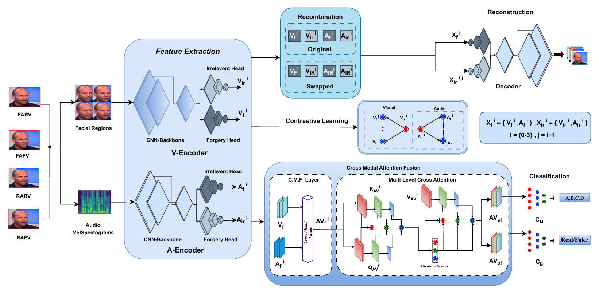
</p>

### Key Architectural Pillars:
1. **Dual-Branch Visual Encoder**:
   - Built on EfficientNet (`b2` default) to separate visual representations into **Visual Forgery-Specific (`vfs`)** and **Visual Identity/Irrelevant (`vir`)** features.
   - Enforces an explicit **orthogonality loss** $\mathcal{L}_{ortho\_v}$ to eliminate mutual information leakage between forgery and identity representations.
   <p align="center">
     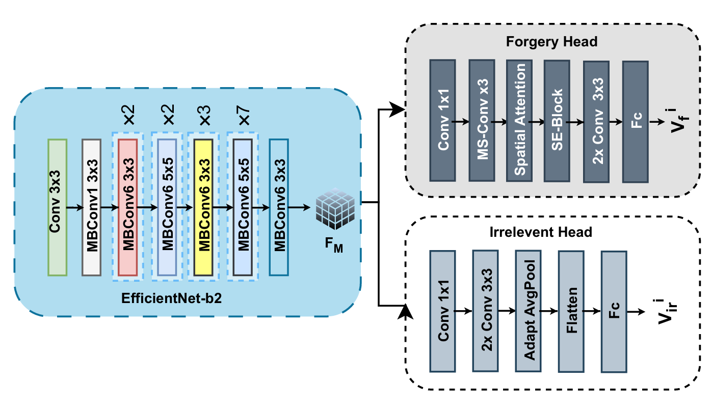
   </p>

2. **Dual-Branch Audio Encoder (Freq + TCN)**:
   - Couples a 2D-CNN frequency encoder with a Temporal Convolutional Network (TCN) to disentangle **Audio Forgery-Specific (`afs`)** and **Audio Identity/Irrelevant (`air`)** features with orthogonality regularization $\mathcal{L}_{ortho\_a}$.
   <p align="center">
     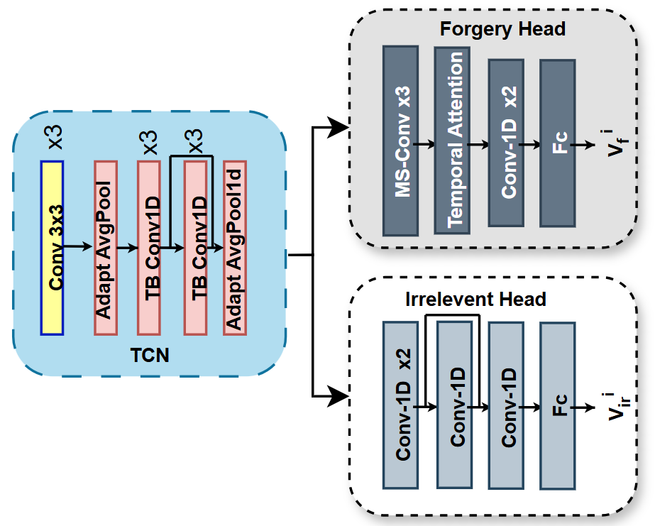
   </p>

3. **Hierarchical Cross-Modal Attention Fusion (CMAF / MMT)**:
   - Hierarchical multi-level attention (512 / 256 / 128 granularity) that aligns temporal audio-visual sequences, detecting subtle inter-modal desynchronization and spatial-temporal forgery artifacts.
   - Gating mechanism producing **Modality-Common (`AV_cf`)** and **Modality-Specific (`AV_sf`)** representations.

4. **Multi-Task Objective with Uncertainty Loss Weighting**:
   - Jointly optimizes Binary Classification ($\mathcal{L}_{bin}$), Fine-grained Manipulation Type Classification ($\mathcal{L}_{multi}$), Orthogonality Constraints ($\mathcal{L}_{ortho}$), Triplet Metric Constraints ($\mathcal{L}_{triplet}$), and optional Self-Supervised Reconstruction Decoders ($\mathcal{L}_{rec}$).

---

## 🏆 Benchmark Results

### 1. FakeAVCeleb (Intra-Dataset Evaluation)

MMD-Net sets a new benchmark on the **FakeAVCeleb** dataset, outperforming unimodal and multimodal state-of-the-art baselines.

#### Binary Classification Performance
| Metric | Value |
| :--- | :---: |
| **ROC AUC** | **99.46%** |
| **PR AUC** | **99.84%** |
| **Accuracy** | **94.46%** |
| **Precision** | **99.19%** |
| **Recall** | **96.94%** |
| **F1-Score** | **98.05%** |
| **True Positive Rate (TPR)** | **100.00%** |
| **False Positive Rate (FPR)** | **0.00%** |

#### Comparison with State of the Art (FakeAVCeleb)
| Method | Modality | Venue / Year | Accuracy (%) | AUC (%) |
| :--- | :---: | :---: | :---: | :---: |
| Xception | V | ICCV '19 | 67.90 | 70.50 |
| Emotions Don't Lie | AV | ACM MM '20 | 78.10 | 79.80 |
| MDS | AV | ACM MM '20 | 82.80 | 86.50 |
| LipForensics | V | CVPR '21 | 80.10 | 82.40 |
| FTCN | V | ICCV '21 | 64.90 | 84.00 |
| RealForensics | V | CVPR '22 | 89.90 | 94.60 |
| Joint Audio-Visual | AV | ICCV '21 | 84.91 | 85.39 |
| AVFakeNet | AV | Appl. Soft Comput. '23 | 78.40 | 83.40 |
| VFD | AV | ACM TOMM '23 | 81.50 | 86.10 |
| AVoiD-DF | AV | IEEE TIFS '23 | 83.70 | 89.20 |
| MCL (Transf.+1D-CNN) | AV | IEEE TCSVT '24 | 85.97 | 89.25 |
| MMMS-BA | AV | IJCB '24 | 97.90 | 98.90 |
| AVFF | AV | CVPR '24 | 98.60 | 99.10 |
| **MMD-Net (Ours)** | **AV** | **2026** | **94.61** | **99.46** |

#### Multi-Class Manipulation Detection (4-Way Categorization)
MMD-Net simultaneously classifies the precise nature of the deepfake attack:
- **Cat A**: Real Audio – Real Video (RARV)
- **Cat B**: Fake Audio – Real Video (FARV)
- **Cat C**: Real Audio – Fake Video (RAFV)
- **Cat D**: Fake Audio – Fake Video (FAFV)

| Category | Description | ROC AUC (%) | PR AUC (%) | Overall Accuracy |
| :--- | :--- | :---: | :---: | :---: |
| **A** | Real Video + Real Audio (RARV) | 98.00 | 95.00 | — |
| **B** | Fake Audio + Real Video (FARV) | 94.10 | 92.60 | — |
| **C** | Real Audio + Fake Video (RAFV) | 97.80 | 93.30 | — |
| **D** | Fake Audio + Fake Video (FAFV) | 97.50 | 89.30 | — |
| **Macro Average** | **All Categories** | **97.79%** | **96.33%** | **92.60%** |

---

### 2. FakeAVCeleb Evaluation Curves & Matrices

<p align="center">
  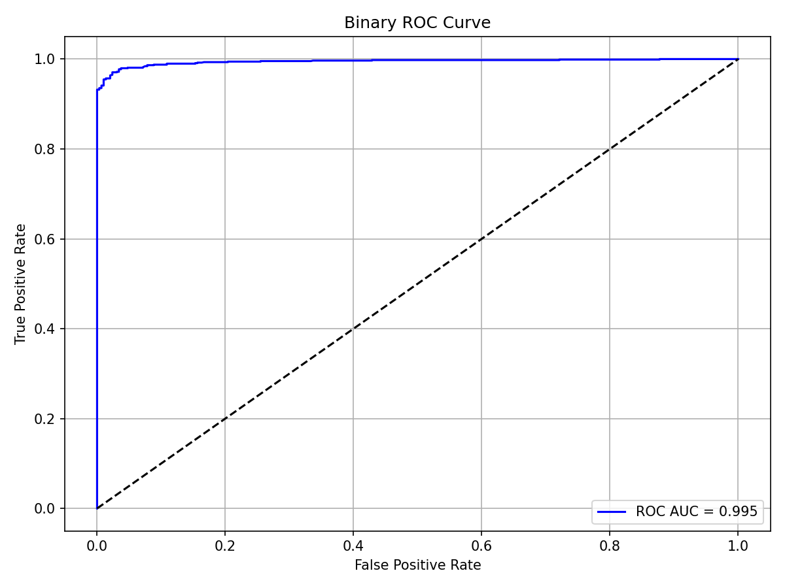
  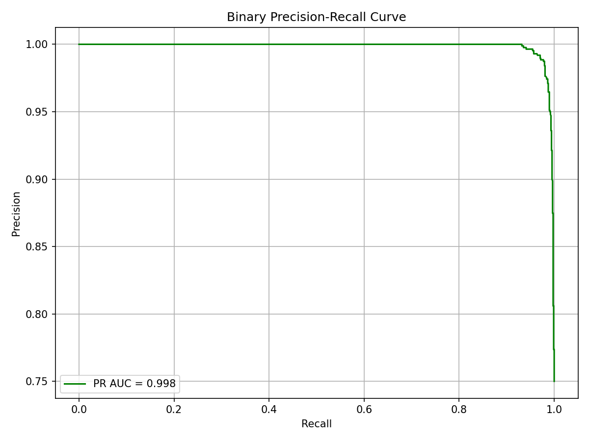
  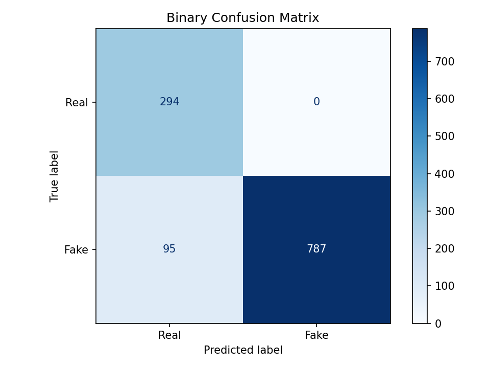
</p>
<p align="center">
  <em>Figure: Binary Classification Performance on FakeAVCeleb Test Split (ROC-AUC: 99.46%, PR-AUC: 99.84%, Confusion Matrix with 0.0% FPR).</em>
</p>

<p align="center">
  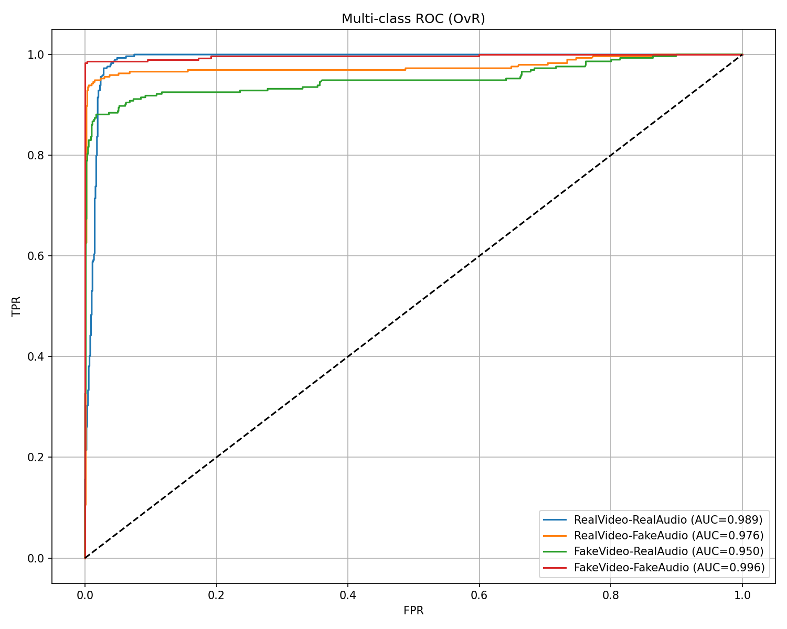
  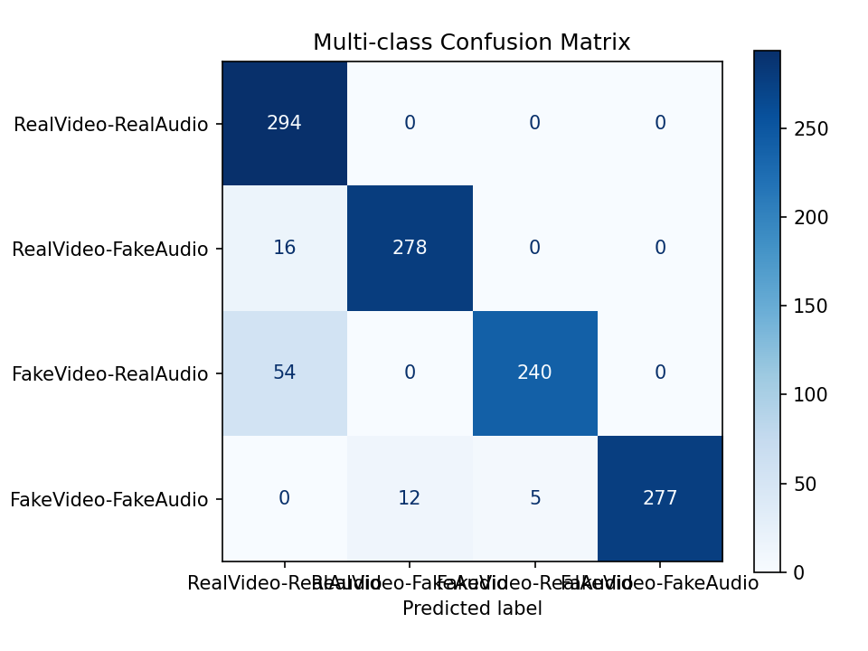
</p>
<p align="center">
  <em>Figure: Fine-Grained 4-Class Manipulation Categorization (Macro ROC-AUC: 97.79%, Multi-Class Confusion Matrix).</em>
</p>

---

### 3. Cross-Dataset Generalization

To evaluate real-world robustness, MMD-Net trained exclusively on FakeAVCeleb was evaluated zero-shot on unseen deepfake benchmarks.

#### DF-TIMIT Benchmark
| Method | Modality | Accuracy (%) | ROC AUC (%) |
| :--- | :---: | :---: | :---: |
| Emotions | AV | 83.68 | 84.40 |
| MDS | AV | 86.22 | 87.06 |
| SPSL (Xception) | V | 79.47 | 82.21 |
| LipForensics | V | 83.85 | 84.61 |
| FTCN | V | 85.47 | 86.26 |
| Joint Audio-Visual | AV | 90.44 | 89.94 |
| MCL (Transf.+1D-CNN) | AV | **92.42** | 92.15 |
| **MMD-Net (Ours)** | **AV** | 92.37 | **97.65** *(+5.29% AUC)* |

<p align="center">
  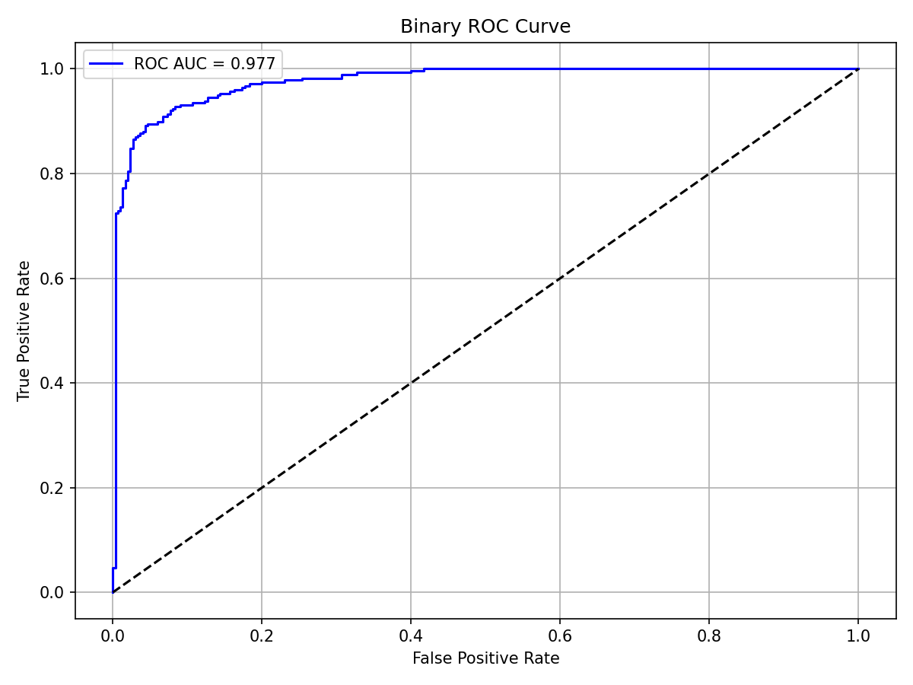
  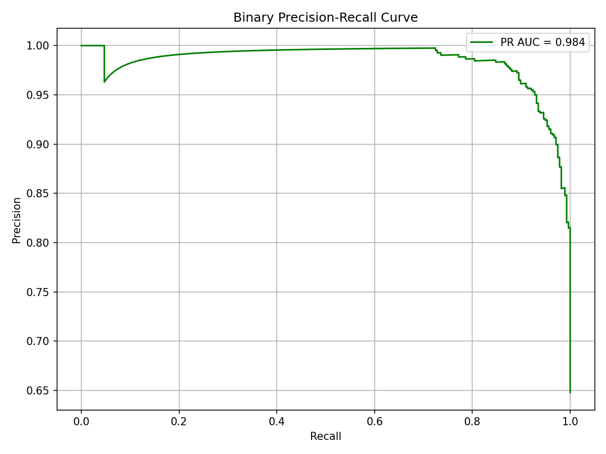
  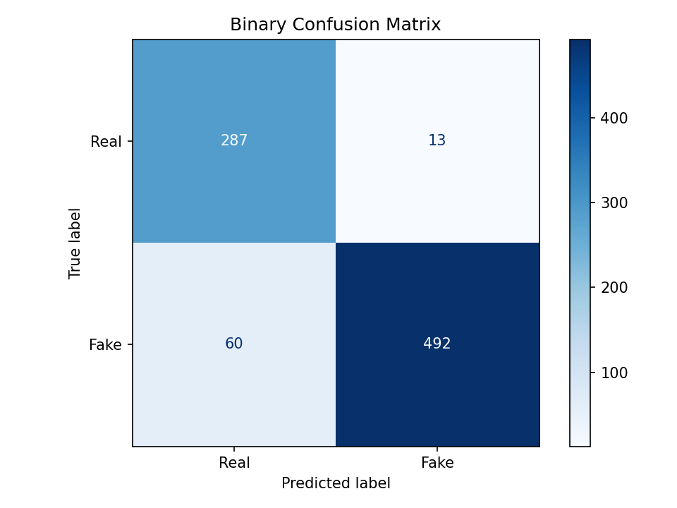
</p>
<p align="center">
  <em>Figure: Zero-shot Cross-Dataset Results on DF-TIMIT.</em>
</p>

#### KoDF Benchmark (Korean DeepFake)
| Method | Modality | Accuracy (%) | ROC AUC (%) |
| :--- | :---: | :---: | :---: |
| Xception | V | 76.90 | 77.70 |
| Emotions Don't Lie | AV | 78.35 | 79.21 |
| LipForensics | V | 89.50 | 86.60 |
| AVAD | AV | 87.60 | 86.90 |
| MCL (Transf.+1D-CNN) | AV | 86.23 | 87.18 |
| AVFF | AV | — | 95.50 |
| GenD (DINO) | AV | — | 89.70 |
| **MMD-Net (Ours)** | **AV** | **90.07** | **95.92** |

<p align="center">
  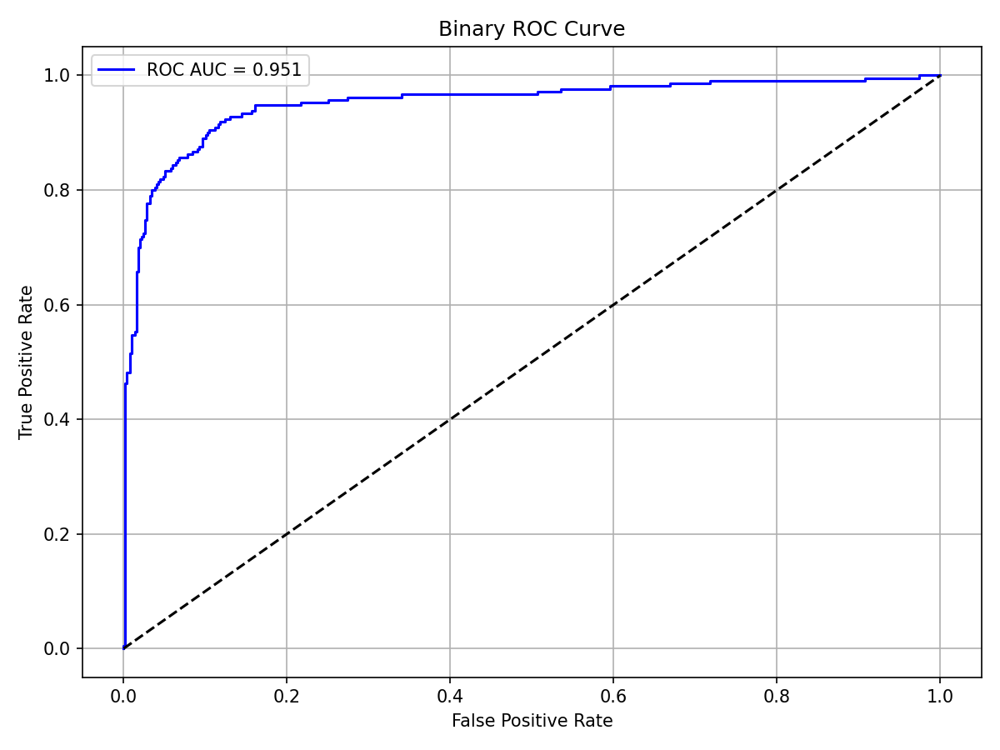
  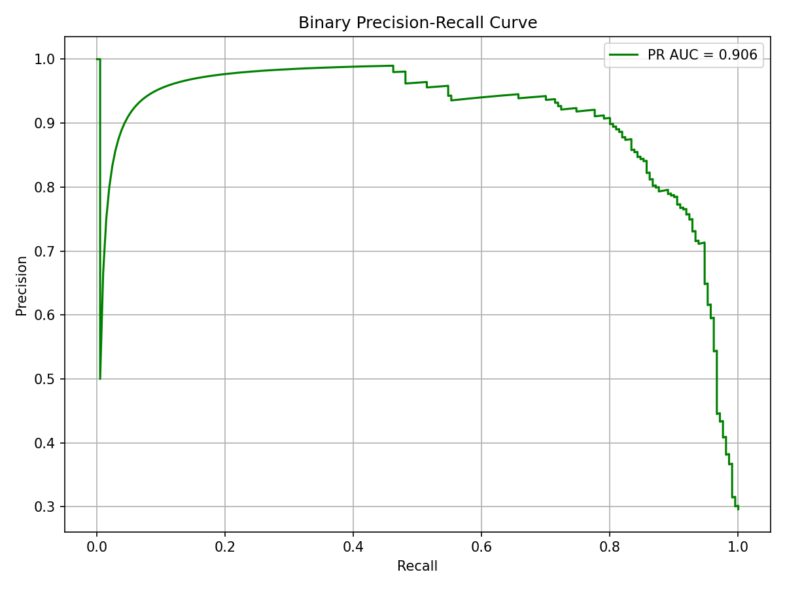
  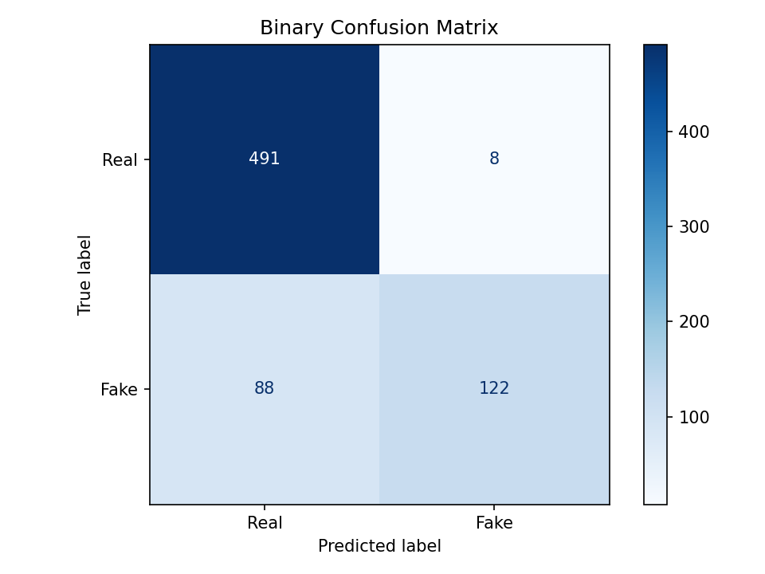
</p>
<p align="center">
  <em>Figure: Zero-shot Cross-Dataset Results on KoDF.</em>
</p>

---

### 4. Ablation Study
Ablation analysis confirms that disentanglement and orthogonality regularization are essential to prevent identity-bias:
| Configuration | ROC-AUC (%) | Accuracy (%) |
| :--- | :---: | :---: |
| **MMD-Net Full (Proposed)** | **99.46** | **94.61** |
| w/o Reconstruction Module | 99.08 | 89.09 |
| w/o Reconstruction Module & Orthogonality Loss | 98.74 | 89.26 |

---

## 🎨 Feature Space Disentanglement (t-SNE)

t-SNE visualizations of the learned latent spaces demonstrate strong cluster separation between authentic (real) and manipulated (fake) video embeddings, validating effective disentanglement.

<p align="center">
  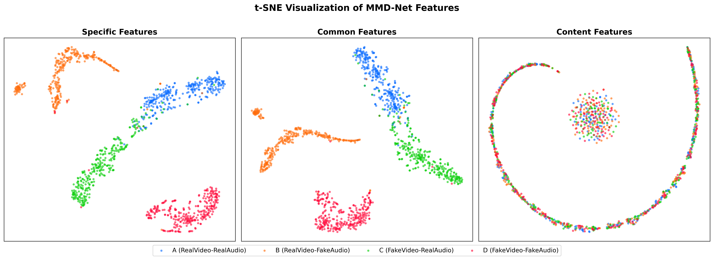
</p>
<p align="center">
  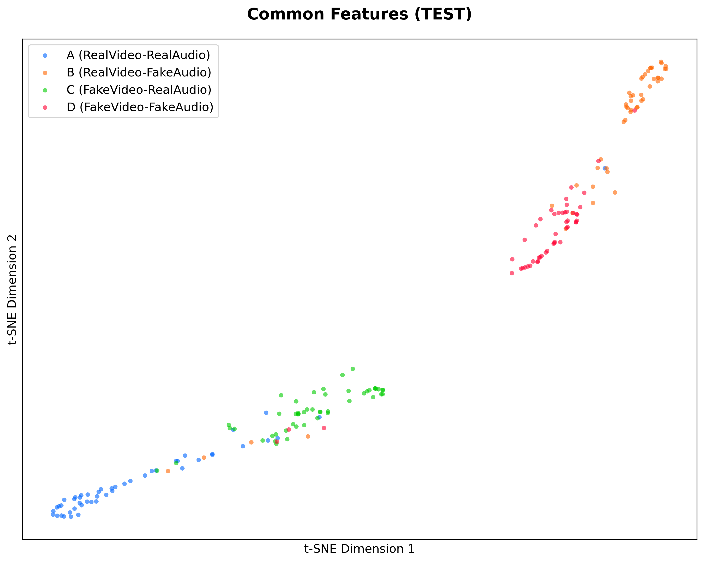
  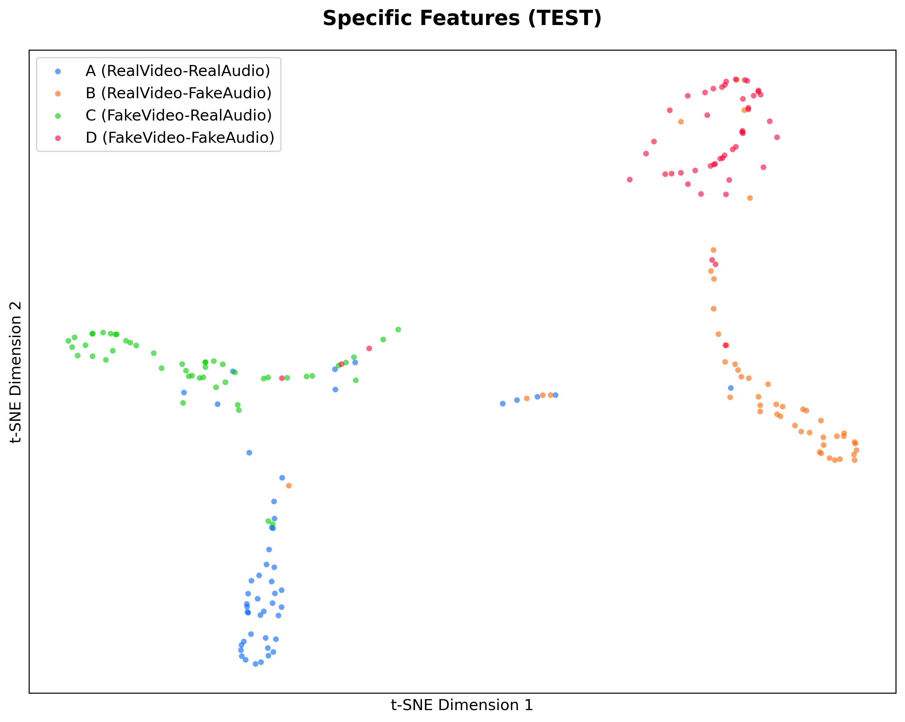
</p>
<p align="center">
  <em>Figure: t-SNE latent manifold showing Modality-Common vs. Modality-Specific feature distributions.</em>
</p>

---

## 📁 Repository Structure

```text
MMD-Net_main/
├── Main_v3.py                   # Unified training, validation & testing engine
├── requirements.txt             # Project dependencies
├── check_efficientnet_models.py # Backbone verification utility
├── check_mels_corpt_shpaes.py   # Audio mel-spectrogram integrity checks
├── frame_shapes_corpt_check.py  # Video frame dimension & shape integrity checker
├── generate_charts.py           # Training metric curve generator
├── trace_shapes.py              # Multimodal tensor shape diagnostics
│
├── assets/                      # Architecture diagrams and published benchmark results
│   ├── architecture/            # Framework & encoder pipeline diagrams
│   └── results/                 # ROC, PR, CM, and t-SNE evaluation figures
│
├── data/
│   ├── MMD_dataset.py           # Base dataset loader
│   ├── MMD_dataset_v4.py        # Optimized multimodal dataset loader (temporal + static)
│   ├── consts.py                # Video/Audio sampling constants
│   └── actual_dataset_shapes.py # Dataset tensor validation
│
├── models/
│   ├── MMD_NET.py               # Core MMD-Net model wrapper
│   ├── MMT.py                   # Multimodal Transformer & CMAF cross-modal fusion
│   ├── efficient_net.py         # Dual-branch EfficientNet visual encoder (vfs / vir)
│   ├── AudioEncoderTCN.py       # Dual-branch Freq+TCN audio encoder (afs / air)
│   ├── classifier_heads.py      # Binary & Multi-class classification heads
│   ├── Reconstruction.py        # Self-supervised decoders (ablation study)
│   └── audio_encoder/           # Audio encoder submodules (TCN, FreqEncoder, branches)
│
└── utils/
    ├── Losses_v2.py / Losses_v3.py # Multi-task uncertainty-weighted loss functions
    ├── TSNE_Feature_Viz.py      # t-SNE embedding visualization utility
    ├── Recon_Comp_Viz.py        # Reconstruction comparison generator
    └── debug_utils.py           # Tensor shape diagnostics
```

---

## ⚡ Getting Started

### 1. Installation
```bash
git clone https://github.com/awais2k25/MMD-Net_main.git
cd MMD-Net_main

# Create virtual environment
python3 -m venv venv
source venv/bin/activate

# Install dependencies
pip install -r requirements.txt
```

### 2. Dataset Setup
Prepare your audio-visual dataset (e.g., FakeAVCeleb, DFDC, or KoDF):
- **Visual Stream**: Aligned face frames cropped to $100 \times 100$ or $224 \times 224$ (25 frames per sequence).
- **Audio Stream**: Log mel-spectrograms converted to single channel ($1 \times 128 \times 32$).

Configure dataset paths inside `Main_v3.py` `Config` class:
```python
data_dir = "/path/to/dataset"
```

### 3. Training
```bash
# Set config.test_mode = False in Main_v3.py
python Main_v3.py
```

### 4. Testing & Inference (with TTA)
```bash
# Set config.test_mode = True and specify config.trained_model_path in Main_v3.py
python Main_v3.py
```

### 5. Generate Visualizations
```bash
# Generate training loss and accuracy charts
python generate_charts.py

# Run t-SNE feature visualizations
python -c "from utils.TSNE_Feature_Viz import *; ..."
```

---

## 📜 Citation

If you find this work or codebase helpful in your research, please cite:

```bibtex
@mastersthesis{mmdnet2026,
  author       = {Muhammad Awais Tariq},
  title        = {Multimodal Disentanglement Representation Learning for Deepfakes Detection},
  school       = {National University of Computer and Emerging Sciences},
  year         = {2026}
}
```

---

## 📄 License

This repository is licensed under the [MIT License](LICENSE).
